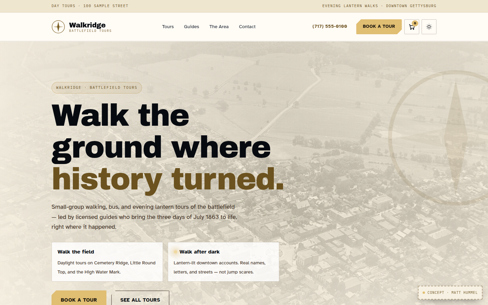
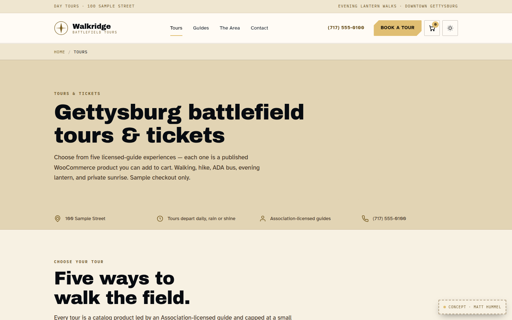
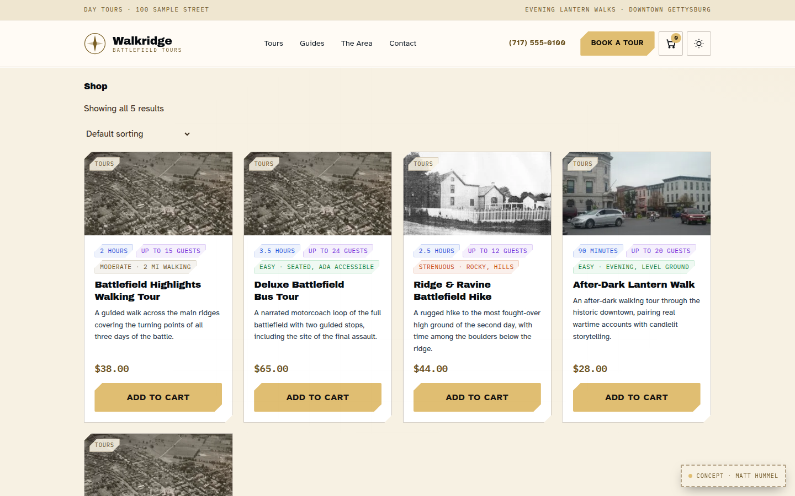
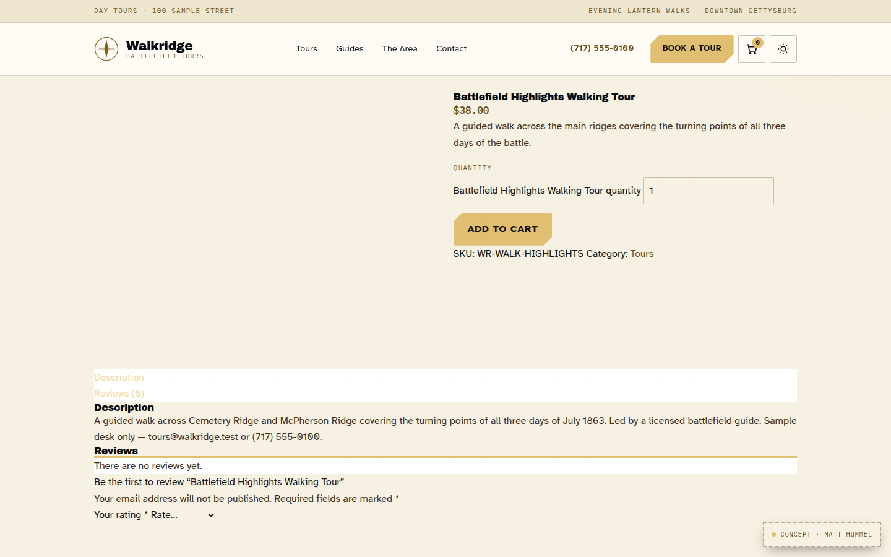
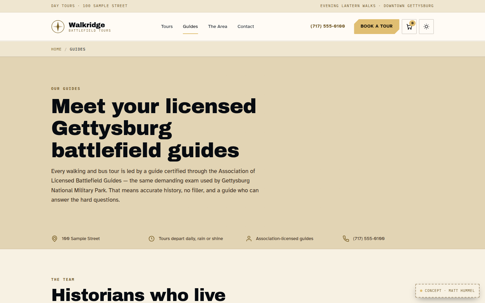
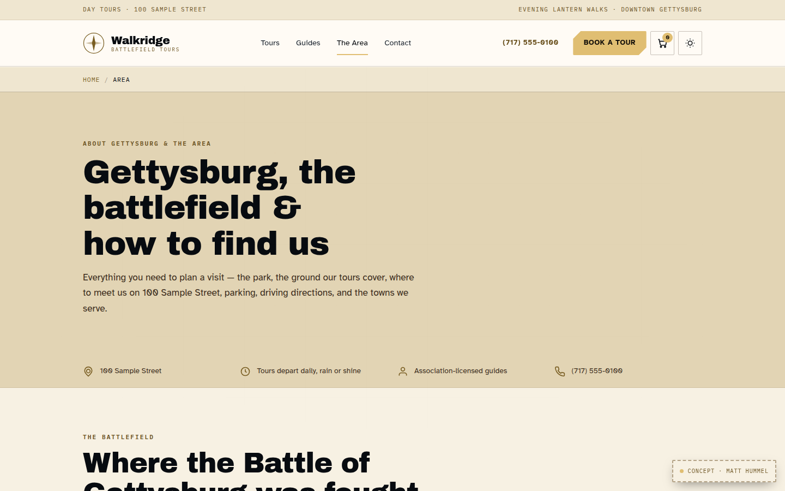
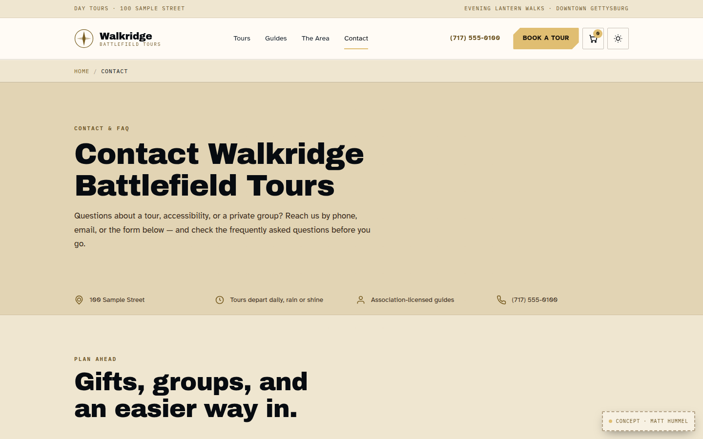
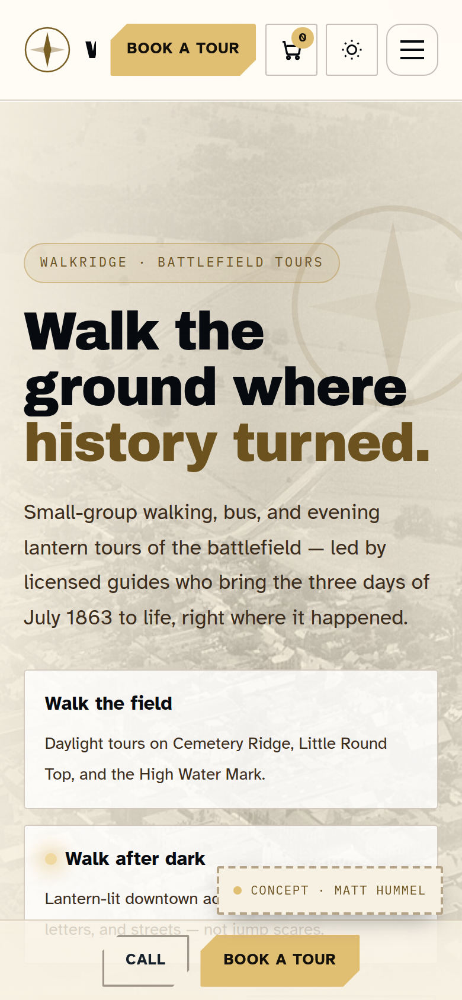
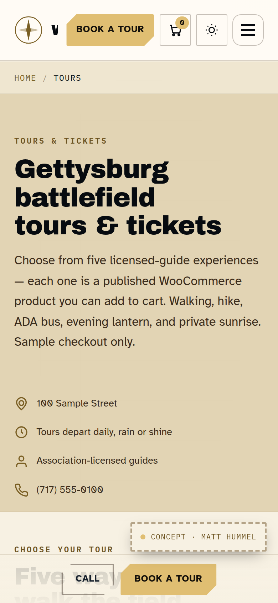
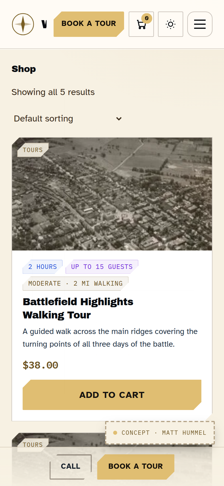

<p align="center">
  
</p>

<h1 align="center">Walkridge</h1>

<p align="center"><strong>A WordPress theme for licensed-guide battlefield tours.</strong><br>
Browse tours, meet the guides, learn the ground, and book from a WooCommerce shop — without a page builder.</p>

<p align="center">
  <a href="https://walkridge.matthummel.com/"></a>
  <a href="LICENSE.md"></a>
  <a href="https://wordpress.org/"></a>
  <a href="https://www.php.net/"></a>
  <a href="SUPPORT.md"></a>
</p>

| | |
|---|---|
| **Theme version** | **1.7.2** (`style.css`) |
| **Live concept** | [walkridge.matthummel.com](https://walkridge.matthummel.com/) |
| **Portfolio** | [matthummel.com/projects/walkridge](https://matthummel.com/projects/walkridge/) |
| **Install folder** | **`walkridge`** (keep this exact name) |
| **Author** | [Matt Hummel](https://matthummel.com/) |
| **Support** | [SUPPORT.md](SUPPORT.md) · [GitHub Issues](https://github.com/matthummel-pa/wp-walkridge/issues) |
| **Updates** | [Appearance → Update Theme](docs/UPDATE-THEME.md) · [GitHub Releases](https://github.com/matthummel-pa/wp-walkridge/releases) |

> **Concept demo, not a ticket desk.** The Gettysburg office, reviews, prices, and checkout on the live site are sample data for the theme. Phones use the `555` range (office `(717) 555-0100`). Emails use `@walkridge.test`. Walkridge is not a licensed park concession or a live payment processor.

---

## Who it is for

Tour operators and historians who sell **licensed-guide walking, bus, hike, and evening tours** — not a generic travel blog and not a magazine skin with a contact form taped on.

Use it if you need:

- A public site that can become a **WooCommerce catalog of tour products**
- Gutenberg layouts for Home, Tours, Guides, Area, Contact, and Refund Policy
- Identity (phone, hours, logo, Book CTA) in **Appearance → Theme Settings**, not a page builder
- Light parchment as the default, with an optional dark toggle

Skip it if you want Elementor, a newspaper homepage, or a generic Woo fashion store.

---

## Why not a generic blog theme

| Walkridge | Typical “tour” blog theme |
|---|---|
| Tours are **shop products** guests can add to cart | Tours are posts or a slider |
| Guide roster, area map, refund windows, FAQ as **blocks** | One “About” page |
| Identity lives in Theme Settings (NAP, hours, CTA) | Hardcoded header phone |
| WCAG 2.2 contrast, 44px targets, skip link, light default | Dark overlay hero, mystery contrast |
| Sage 11 + Vite production zip — buyers do not run npm on the host | Upload-and-hope CSS |

---

## Screenshots

Captured from the live concept at [walkridge.matthummel.com](https://walkridge.matthummel.com/) (theme **1.7.2**). The same shots are on the [Walkridge project](https://matthummel.com/projects/walkridge/) on matthummel.com — that site is a portfolio, not a theme cart. Extra crops live in [`docs/marketplace/screenshots/`](docs/marketplace/screenshots/).

**Desktop (~1440)**















**Mobile (~390)**

| Home | Tours | Shop |
|---|---|---|
|  |  |  |

---

## What you get

- **Marketing pages** — Home, Tours, Guides, Area, Contact, Refund Policy, rendered from Gutenberg (`the_content()`)
- **Walkridge block collection** — home hero, tour grid, guide roster, area map, contact desk, FAQ, reviews, book band, and more ([docs/BLOCKS.md](docs/BLOCKS.md))
- **WooCommerce tour products** — shop, product, cart, checkout, and account templates; five seeded concept products on new installs
- **Theme Settings** — brand, logo, phone, email, hours, header CTA, social, light/dark default, demo badge ([docs/THEME-SETTINGS.md](docs/THEME-SETTINGS.md))
- **Update Theme** — install a compiled `walkridge.zip` or the latest GitHub Release ([docs/UPDATE-THEME.md](docs/UPDATE-THEME.md))
- **Light default + WCAG 2.2** — parchment first paint, gold-800 body links, focus rings, named payment marks, optional dark
- **Regular SEO** — title, description, canonical, Open Graph, Twitter cards (yields to Yoast / Rank Math / SEOPress / AIOSEO)
- **Child theme** — `child-theme/` for CSS that should survive parent updates
- **No page builder required**

Optional pack plugins (**Walkridge Bookings**, **Walkridge Field Map**) are sold separately. They are not inside the theme zip.

### Stack (for developers and ThemeForest reviewers)

[Sage 11](https://roots.io/sage/) + Acorn, Blade, Tailwind CSS v4, Vite 8. Source is this git repo. Marketplace buyers receive a **pre-built zip** with `public/build` and production `vendor/` — Composer and npm are not required on the host.

---

## Quick start — zip install

1. Unzip the outer pack. Upload the inner **`walkridge.zip`** via **Appearance → Themes → Add New**.
2. The folder must stay named **`walkridge`**.
3. Optional: install WooCommerce and turn off **Coming soon**.
4. **Appearance → Theme Settings** — brand, phone, email, hours, logo.
5. Assign **Primary** and **Footer** menus. Publish pages with slugs `tours`, `guides`, `area`, `contact`.
6. **Theme Settings → Advanced** or **Tools → Walkridge Blocks** — seed Gutenberg layouts.

Full help: [SUPPORT.md](SUPPORT.md). Marketplace hub: [docs/marketplace/](docs/marketplace/).

---

## Quick start — developer (this repo)

```bash
git clone https://github.com/matthummel-pa/wp-walkridge.git
cd wp-walkridge
bin/setup-wp.sh
wp server --path="$HOME/wp" --host=0.0.0.0 --port=8080 --allow-root
```

`bin/setup-wp.sh` installs theme deps, builds Vite assets, stands up WordPress at `~/wp` (SQLite), symlinks the theme as **`walkridge`**, and activates WooCommerce.

Admin: `http://localhost:8080/wp-admin` — `admin` / `admin123`

Developer notes: [DEVELOPMENT.md](DEVELOPMENT.md) · Cloud: [AGENTS.md](AGENTS.md)

---

## Updates

1. Publish a GitHub Release tagged `vX.Y.Z` with compiled **`walkridge.zip`** (do not commit that zip to `main`).
2. On the site: **Appearance → Update Theme** → Install latest GitHub Release, or upload the zip.

WordPress also offers **Update now** on Appearance → Themes when a newer Release exists.

---

## Support

| | |
|---|---|
| [SUPPORT.md](SUPPORT.md) | Install, Theme Settings, blocks, Woo, child theme, FAQ, troubleshooting |
| [GitHub Issues](https://github.com/matthummel-pa/wp-walkridge/issues) | Reproducible theme bugs (versions + steps) |
| [CHANGELOG.md](CHANGELOG.md) | Version history |

---

## License

GPLv2 or later. See [`license.txt`](license.txt), [`LICENSE.md`](LICENSE.md), and [`CREDITS.md`](CREDITS.md). Sage 11 and Acorn remain MIT (GPL-compatible).

Compass mark in the header is original Walkridge artwork (same SVG as the default logo). Bundled Gettysburg photographs are public-domain / Wikimedia; fonts are SIL OFL — listed in CREDITS.

Author: [Matt Hummel](https://matthummel.com/)
