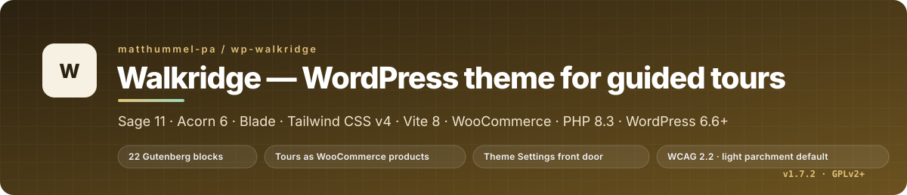
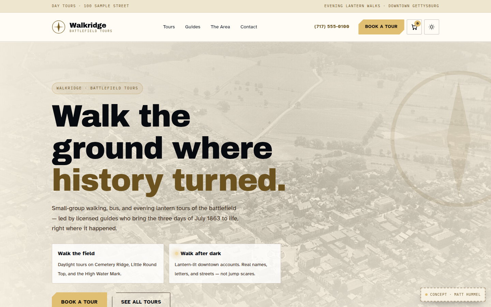
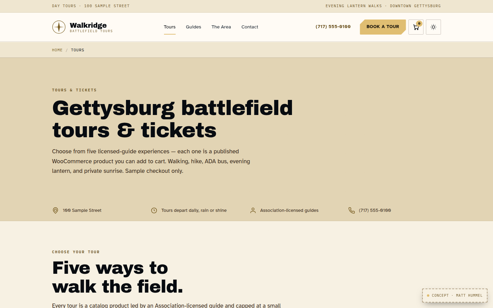
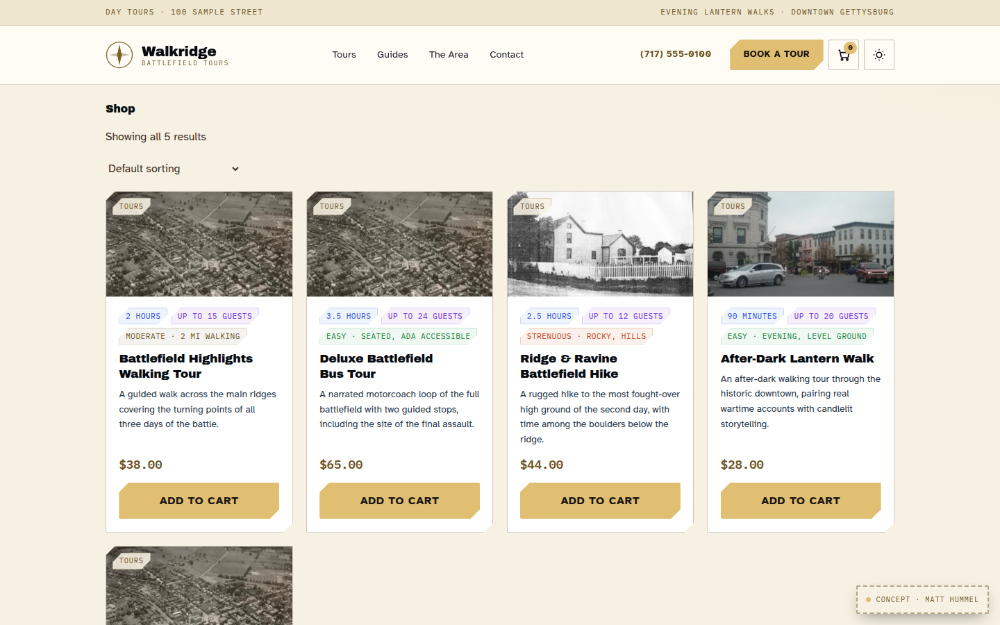
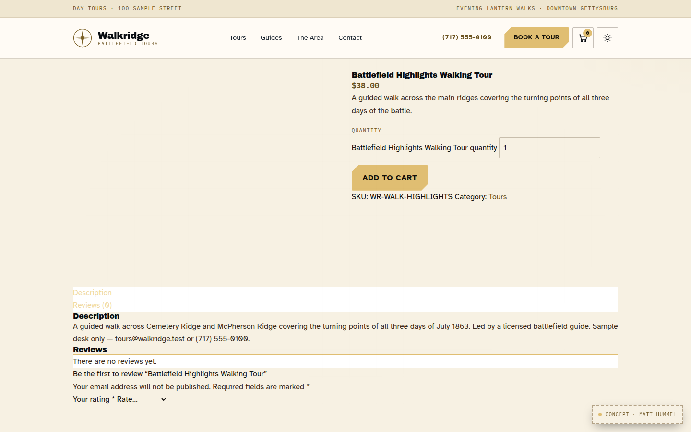
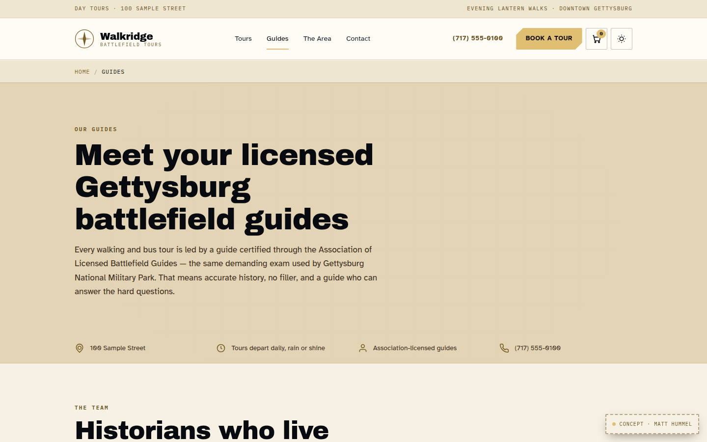
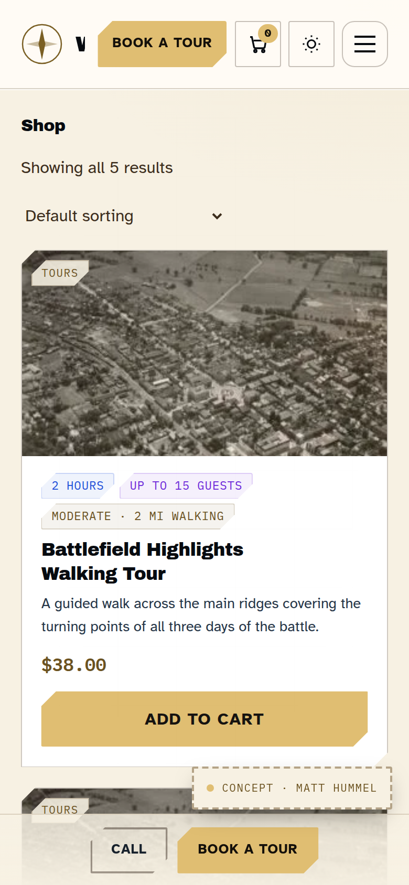

<p align="center">
  <a href="https://walkridge.matthummel.com/"></a>
</p>

<p align="center">
  <a href="https://github.com/matthummel-pa/wp-walkridge/actions/workflows/wp-review.yml"></a>
  <a href="https://github.com/matthummel-pa/wp-walkridge/releases"></a>
  <a href="CHANGELOG.md"></a>
  
  
  
  
  <a href="LICENSE.md"></a>
</p>

# Walkridge

**Walkridge** is a WordPress theme for **tour operators and licensed guides** — walking, bus, hike, and evening tours sold as **WooCommerce products**, with guide rosters, area pages, refund windows, and FAQs built from Gutenberg blocks. Identity lives in **Appearance → Theme Settings**, not in a page builder. Light parchment by default, WCAG 2.2 contrast, optional dark.

This README is for **buyers** comparing tour themes, **developers** extending or reviewing it, and **hiring managers** who want to see a WooCommerce-ready Sage 11 theme taken from concept to release.

| | |
| --- | --- |
| **Live demo** | [walkridge.matthummel.com](https://walkridge.matthummel.com/) — concept data (`555` phones, `@walkridge.test` emails; not a licensed concession or live payment desk) |
| **Project page** | [matthummel.com/projects/walkridge](https://matthummel.com/projects/walkridge/) · [SUPPORT.md](SUPPORT.md) · [issues](https://github.com/matthummel-pa/wp-walkridge/issues) |
| **Stack** | Sage 11 · Acorn 6 · Blade · Tailwind CSS v4 · Vite 8 · WooCommerce · PHP 8.3+ · WordPress 6.6+ |
| **Size** | 14 PHP modules (~4k lines) · 30 Blade templates + WooCommerce overrides · 22 Gutenberg blocks · 49 Theme Settings + 8 Customizer fields · ~3.4k lines of CSS |
| **History** | 40 commits on 8 working days · 14 releases (1.0.0 → 1.7.2, Sep 6 → Sep 21, 2026) · 7 release tags |
| **Quality gates** | `wp-review` (WordPress Coding Standards on changed lines) · Pint · PHPStan config · Vite build · live WCAG 2.2 pass each release |
| **Ships as** | Compiled `walkridge.zip` on GitHub Releases (buyers never run Composer or npm) · optional child theme · optional Bookings and Field Map plugins |
| **License** | [GPLv2 or later](LICENSE.md) · Sage and Acorn remain MIT |

<table>
  <tr>
    <td align="center"><a href="docs/readme/home-desktop.png"></a><br /><sub><strong>Home</strong> — hero, stats, pathway cards</sub></td>
    <td align="center"><a href="docs/readme/tours-desktop.png"></a><br /><sub><strong>Tours</strong> — grid, durations, prices</sub></td>
  </tr>
  <tr>
    <td align="center"><a href="docs/readme/shop-desktop.png"></a><br /><sub><strong>Shop</strong> — tours as WooCommerce products</sub></td>
    <td align="center"><a href="docs/readme/product-desktop.png"></a><br /><sub><strong>Product</strong> — add to cart, details, policy</sub></td>
  </tr>
  <tr>
    <td align="center"><a href="docs/readme/guides-desktop.png"></a><br /><sub><strong>Guides</strong> — roster, bios, reviews</sub></td>
    <td align="center"><a href="docs/readme/home-mobile.png"></a> <a href="docs/readme/shop-mobile.png"></a><br /><sub><strong>Mobile</strong> — home and shop</sub></td>
  </tr>
</table>

<p align="center"><sub>More captures, including cart, checkout, and 1200×900 store images: <a href="docs/marketplace/screenshots/">docs/marketplace/screenshots/</a>.</sub></p>

## Contents

- [Why Walkridge](#why-walkridge)
- [Features](#features)
- [Architecture](#architecture)
- [How it was built](#how-it-was-built)
- [Engineering practices](#engineering-practices)
- [What I learned](#what-i-learned)
- [Install (buyers)](#install-buyers)
- [Develop (this repo)](#develop-this-repo)
- [Release and updates](#release-and-updates)
- [Repository map](#repository-map)
- [Documentation](#documentation)
- [Related repositories](#related-repositories)
- [License and credits](#license-and-credits)

## Why Walkridge

Most "tour" themes are magazine skins with a contact form taped on: tours are posts or a slider, the phone number is hardcoded in the header, and the hero is a dark overlay with mystery contrast. Walkridge treats a tour company as what it is — a small shop with a schedule, a roster, and a place.

| Decision | What it means for the operator |
| --- | --- |
| **Tours are WooCommerce products** | Guests add a tour to the cart and check out. Catalog, product, cart, checkout, and account templates ship in the theme; five concept products seed on install. |
| **Pages are blocks** | Home, Tours, Guides, Area, Contact, and Refund Policy render from Gutenberg (`the_content()`) using 22 Walkridge blocks. **Tools → Walkridge Blocks** seeds every layout. |
| **Identity is a setting** | Brand, logo, phone, email, hours, header CTA, social, light/dark default, demo badge — **Appearance → Theme Settings**. No code for the office. |
| **Light first, WCAG 2.2** | Parchment first paint, gold-800 links, visible focus, 44 px targets, skip link, named payment marks, text star ratings. Dark is a toggle, not the default. |
| **Compiled zip** | Buyers upload one `walkridge.zip` with `public/build` and production `vendor/`. Composer and npm never run on the host. |
| **Optional, not bundled** | Walkridge Bookings and Walkridge Field Map are separate plugins so the theme stays inside WordPress.org / ThemeForest rules. |

## Features

<details open>
<summary><strong>22 Gutenberg blocks</strong></summary>

Home Hero (stats, path cards, marquee), Page Intro, Info Strip, About Split, Pathway Cards, Timeline (three battle days), Tour Grid, Card Grid, Guest Reviews, Journal Cards, Book Band, Copy Section, Refund Policy (dates, windows, contact), Area Map (photo pin, embed, or Field Map), Area Facts, Town Grid, CTA Band, Contact Desk, FAQ List, Guide Roster, Section Heading, Custom — each a `block.json` folder under [`blocks/`](blocks/) with shared inspector options ([`app/block-options.php`](app/block-options.php)). Full list and page roles: [`docs/BLOCKS.md`](docs/BLOCKS.md).

- **Block Generator** (Tools → Block Generator): custom blocks without writing PHP.
- **Seeded layouts**: `wr_demo_layouts` versions re-seed pages safely and repair encoded block comments from older saves.
</details>

<details open>
<summary><strong>WooCommerce tour shop</strong></summary>

- Blade templates for shop, product, cart, checkout, and My Account under [`woocommerce/`](woocommerce/) with the theme's tokens on Woo blocks.
- Sticky mobile **Book** bar on tours; refund policy block with dates and windows; payment marks with accessible names.
- Five seeded concept products on a new install; WooCommerce is optional — the marketing site runs without it.
</details>

<details open>
<summary><strong>Theme Settings and Customizer</strong></summary>

- **Appearance → Theme Settings**: brand, logo, phone, email, hours, header CTA, social links, light/dark default, demo badge, advanced tools (seed layouts) — 49 settings with a graphical front door ([`docs/THEME-SETTINGS.md`](docs/THEME-SETTINGS.md)).
- **Customizer**: identity fields buyers change first; native custom fields for concept pages ([`app/page-fields.php`](app/page-fields.php)) — no ACF.
- **Forms**: contact and newsletter handlers via `admin-post` with optional AJAX, nonces, and sanitized input ([`app/forms.php`](app/forms.php)).
</details>

<details open>
<summary><strong>Accessibility, SEO, performance</strong></summary>

- WCAG 2.2 AA pass each release: contrast on light and dark, `:focus-visible` rings, fixed skip link, 44 px targets, `<title>` + `aria-label` on footer SVGs, reviews with a text rating.
- Native SEO: title, description, canonical, Open Graph, Twitter cards; yields to Yoast / Rank Math / SEOPress / AIOSEO.
- Server-rendered blocks, hashed Vite assets, bundled SIL-OFL fonts, public-domain Gettysburg photography.
</details>

<details open>
<summary><strong>Operations</strong></summary>

- **Appearance → Update Theme**: install the latest GitHub Release zip or upload one; WordPress also shows **Update now** when a newer release exists ([`docs/UPDATE-THEME.md`](docs/UPDATE-THEME.md)).
- `bin/setup-wp.sh` stands up a SQLite WordPress with WooCommerce and the theme symlinked as `walkridge`; `bin/preview-static.sh` exports a static HTML preview to `dist/`.
- `bin/build-theme-zip.sh` builds the compiled zip buyers receive.
</details>

## Architecture

<p align="center"></p>

**Request.** WordPress resolves the template; `functions.php` boots Acorn and loads `app/*.php` (blocks, block options, Theme Settings, Customizer, page fields, forms, shop helpers, updater, marketplace chrome). Blade views and WooCommerce overrides render with `{{ }}` escaping; every block renders server-side; Vite's manifest maps hashed assets.

**Content.** Tours are WooCommerce products. Page copy is Gutenberg blocks seeded by **Tools → Walkridge Blocks** (version-flagged, repair-aware). Identity is Theme Settings; concept pages use native custom fields.

**Buyer tools.** The 22 blocks share inspector attributes and CSS class helpers so new blocks (or Block Generator output) inherit spacing, width, and tone options. Forms and SEO are native.

**Ship.** `wp-review` runs WordPress Coding Standards on every PR's changed lines; Pint checks style. `bin/build-theme-zip.sh` builds the compiled zip; a GitHub Release `vX.Y.Z` carries it; buyer sites update from wp-admin or upload the zip.

Design tokens: ink `#0c1218`, paper `#f7f1e3`, gold `#c4a35a` with text-safe gold-800 `#6b521f` — defined in `resources/css/app.css` (`@theme`). Mark: [`docs/brand/walkridge-mark.svg`](docs/brand/walkridge-mark.svg) (original artwork, also the default logo).

## How it was built

**Starting point.** Walkridge began on 2026-09-06 as a Sage 11 concept theme for a Gettysburg tour operator, drawing on the static [`tour-hallowed-ground-tours-theme`](https://github.com/matthummel-pa/tour-hallowed-ground-tours-theme) concept. 1.0.0 was a marketplace-ready shell; the next two weeks turned it into a block-built, WooCommerce-ready product.

| Version | Date | What landed |
| --- | --- | --- |
| 1.0.0 – 1.1.0 | Sep 6–12 | Marketplace-ready Sage 11 shell; identity, menus, credits |
| 1.2.0 – 1.3.1 | Sep 12–18 | Theme Settings front door, WooCommerce templates, seeded tour products |
| 1.4.0 – 1.6.1 | Sep 19 | Block collection and `block.json` folders, Block Generator, seeded layouts, Area and Refund Policy blocks, Update Theme page |
| 1.7.0 – 1.7.2 | Sep 19–21 | Light-parchment default, WCAG 2.2 UX pass (navbar, skip link, focus, sticky Book bar, Woo block tokens, review ratings, footer marks), seeder repairs |

**Working method.** Same as my other repos: one-line goal, short plan, small PR, `wp-review` + Pint, review, merge, then a pass on the live demo (keyboard, contrast, Lighthouse). Marketplace constraints — plugin territory, bundled fonts and photos with licenses, no admin upsells — are project rules, not afterthoughts.

**AI as a pair.** Cursor and Claude draft and audit; I read, run, and test everything that ships. The AI never had write access to the live demo.

## Engineering practices

| Practice | Here |
| --- | --- |
| **Server-rendered blocks** | `block.json` + PHP render for all 22; shared inspector options keep them consistent. |
| **Woo without a fork** | Theme overrides in `woocommerce/`, tokens applied to Woo blocks — upgrades stay clean. |
| **Escape late, sanitize early** | Blade `{{ }}`, `esc_url()` on links, nonces and `sanitize_*()` in `app/forms.php`, `JSON_HEX_TAG` on serialized block comments, `wp_slash` on save. |
| **Automated gates** | [`wp-review.yml`](.github/workflows/wp-review.yml) — WordPress Coding Standards on changed lines; Pint; PHPStan config; Vite build. |
| **Accessible by default** | WCAG 2.2 AA checked on every release; light default chosen for contrast; reduced motion respected. |
| **Honest demo** | `555` phones, `@walkridge.test`, concept prices, labelled demo badge. |
| **Docs ship with code** | CHANGELOG per release; `SUPPORT.md` for buyers; `BLOCKS.md`, `THEME-SETTINGS.md`, `UPDATE-THEME.md` for operators. |

## What I learned

1. **Sell the thing, don't describe it.** Making tours WooCommerce products from the start shaped every page toward "book this" instead of "read about this."
2. **Light default is an accessibility decision.** The dark-overlay hero that tour themes love fails contrast constantly. Parchment first, dark as a toggle.
3. **Block seeders need repair paths.** Encoded `<!-- wp:` comments and en-dashes from older saves broke layouts; the seeder now normalizes and repairs, and every seed is versioned.
4. **Shared inspector options pay off at block ten.** Spacing, width, and tone as one helper kept 22 blocks consistent and made the Block Generator possible.
5. **Keep optional plugins optional.** Bookings and Field Map outside the zip kept the theme inside marketplace rules and the core product simple.
6. **A compiled zip is the deliverable.** Buyers should never see `npm`. The build script, not the repo, is what ships.
7. **Audit the live site, not the local one.** The 1.7.x pass found a clipped header action, a skip link that scrolled away, and a sticky bar covering the footer — none visible in the editor.
8. **Named payment marks and text ratings are cheap.** Five minutes of `<title>`/`aria-label` work closed a whole category of screen-reader gaps.

## Install (buyers)

1. Unzip the outer pack. Upload the inner **`walkridge.zip`** via **Appearance → Themes → Add New → Upload Theme**. Keep the folder named `walkridge`.
2. Optional: install WooCommerce and turn off **Coming soon**.
3. **Appearance → Theme Settings** — brand, phone, email, hours, logo.
4. Assign **Primary** and **Footer** menus; publish pages with slugs `tours`, `guides`, `area`, `contact`.
5. **Theme Settings → Advanced** or **Tools → Walkridge Blocks** — seed the Gutenberg layouts.

Requirements: WordPress 6.6+, PHP 8.3+. No Composer or npm on the host. Full help: [`SUPPORT.md`](SUPPORT.md) · marketplace hub: [`docs/marketplace/`](docs/marketplace/).

## Develop (this repo)

```bash
git clone https://github.com/matthummel-pa/wp-walkridge.git
cd wp-walkridge
bin/setup-wp.sh            # installs deps, builds Vite, stands up WordPress (SQLite) at ~/wp, symlinks the theme, activates WooCommerce
wp server --path="$HOME/wp" --host=0.0.0.0 --port=8080 --allow-root
```

Admin: `http://localhost:8080/wp-admin` — `admin` / `admin123`.

| Command | Purpose |
| --- | --- |
| `npm run dev` / `npm run build` | Vite HMR / production build |
| `vendor/bin/pint --test` | PHP style |
| `wp-review --base origin/main` | WordPress Coding Standards on changed lines |
| `bin/build-theme-zip.sh` | Compiled `walkridge.zip` |
| `bin/preview-static.sh` | Static HTML export to `dist/` |
| `bin/dev-servers.sh` | WordPress + Vite together |

Details: [`DEVELOPMENT.md`](DEVELOPMENT.md) · cloud setup: [`AGENTS.md`](AGENTS.md).

## Release and updates

```text
bin/build-theme-zip.sh  →  walkridge.zip (public/build + production vendor)
GitHub Release vX.Y.Z    →  zip attached (never committed to main)
Buyer site               →  Appearance → Update Theme → Install latest GitHub Release
                             (or upload the zip; WordPress also offers "Update now")
```

Details: [`docs/UPDATE-THEME.md`](docs/UPDATE-THEME.md).

## Repository map

```text
app/                 blocks · block-options · blocks-content · block-generator · theme-settings · customizer · page-fields · forms · shop · theme-updater · admin · marketplace · filters · setup
blocks/              22 block folders (block.json + render) and the generator template
resources/views/     Blade layouts, sections, partials
woocommerce/         Shop, product, cart, checkout, account overrides
resources/css/       app.css (@theme tokens) · editor.css · admin-settings.css
resources/js/        Front-end modules and editor scripts
plugins/             walkridge-bookings · walkridge-field-map (optional, sold separately)
child-theme/         Starter child theme
bin/                 setup-wp · dev-servers · build-theme-zip · preview-static · install-php-tools
docs/                BLOCKS · THEME-SETTINGS · UPDATE-THEME · brand/ · readme/ screenshots · marketplace/ · assets/readme/ graphics · archive/ previous READMEs
.github/workflows/   wp-review.yml
```

## Documentation

| File | Purpose |
| --- | --- |
| [`SUPPORT.md`](SUPPORT.md) | Install, Theme Settings, blocks, WooCommerce, child theme, FAQ, troubleshooting |
| [`docs/BLOCKS.md`](docs/BLOCKS.md) · [`docs/THEME-SETTINGS.md`](docs/THEME-SETTINGS.md) · [`docs/UPDATE-THEME.md`](docs/UPDATE-THEME.md) | Operator references |
| [`DEVELOPMENT.md`](DEVELOPMENT.md) | Stack, quick start, daily commands, packaging |
| [`CHANGELOG.md`](CHANGELOG.md) | Version history |
| [`docs/marketplace/`](docs/marketplace/) | Marketplace hub and screenshots |
| [`readme.txt`](readme.txt) · [`CREDITS.md`](CREDITS.md) · [`LICENSE.md`](LICENSE.md) | Parser file, third-party credits, GPL |
| [`docs/archive/`](docs/archive/) | Earlier versions of this README |

## Related repositories

| Repo | What it is |
| --- | --- |
| [matthummel-theme](https://github.com/matthummel-pa/matthummel-theme) | The site that documents and sells Walkridge |
| [wp-acreline](https://github.com/matthummel-pa/wp-acreline) | Sister theme for real estate agents, same Sage 11 foundation |
| [wp-cobbleandcandle](https://github.com/matthummel-pa/wp-cobbleandcandle) | Block theme for restaurants, taverns, and inns |
| [gettysburg-tour-map](https://github.com/matthummel-pa/gettysburg-tour-map) | Self-guided tour map that pairs with the Area page |
| [wp-dev-kit](https://github.com/matthummel-pa/wp-dev-kit) | `wp-review`, review checklist, and agent rules used across repos |

## License and credits

GPLv2 or later — [`license.txt`](license.txt), [`LICENSE.md`](LICENSE.md). Sage 11 and Acorn remain MIT (GPL-compatible). The compass mark is original Walkridge artwork; bundled Gettysburg photographs are public domain / Wikimedia; fonts are SIL OFL — all listed in [`CREDITS.md`](CREDITS.md).

Author: [Matt Hummel](https://matthummel.com/) · Live demo: [walkridge.matthummel.com](https://walkridge.matthummel.com/) · Open for WordPress work: [matthummel.com/hire](https://matthummel.com/hire/)
