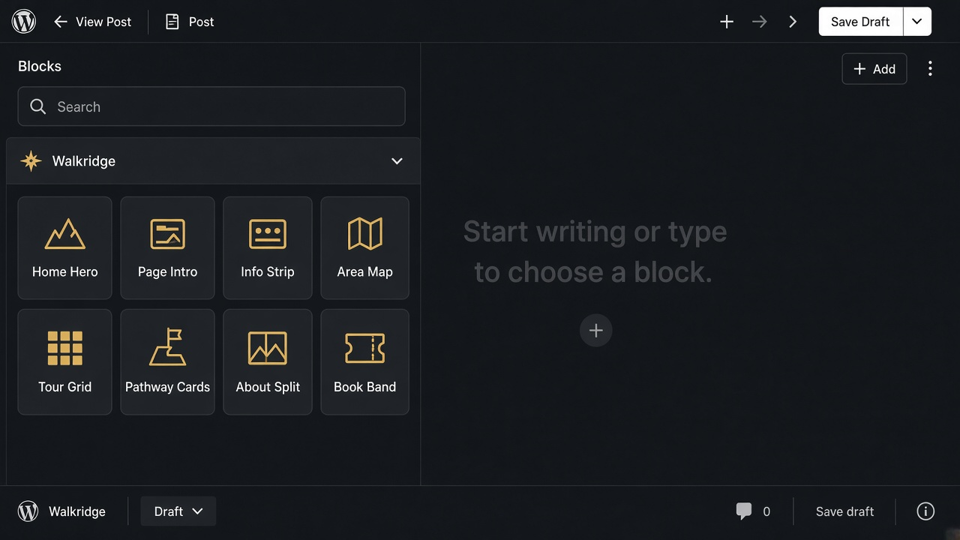
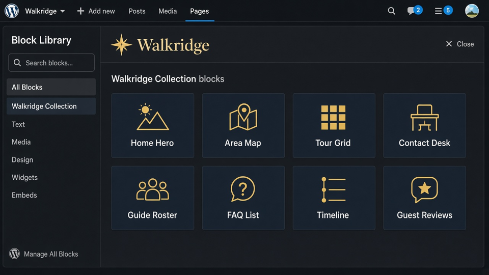

# Walkridge block SOP
Marketing copy lives in **Walkridge** Gutenberg blocks, not page custom fields. Theme Settings / Customizer stay for office identity.
## Block selection
1. Edit a page → **plus** inserter.
2. Open the **Walkridge** folder (compass icon). Every theme block is packaged under `blocks/{slug}/` in the theme.
3. Search `walkridge` if the folder is collapsed.

## Library

| Block | SOP |
|---|---|
| Home Hero | [home-hero](home-hero.md) |
| Page Intro | [page-intro](page-intro.md) |
| Info Strip | [info-strip](info-strip.md) |
| Section Heading | [section-heading](section-heading.md) |
| Tour Grid | [tour-grid](tour-grid.md) |
| Pathway Cards | [pathway-cards](pathway-cards.md) |
| About Split | [about-split](about-split.md) |
| Book Band | [book-band](book-band.md) |
| CTA Band | [cta-band](cta-band.md) |
| Custom (Generator) | [custom](custom.md) |
| Contact Desk | [contact-desk](contact-desk.md) |
| FAQ List | [faq-list](faq-list.md) |
| Guide Roster | [guide-roster](guide-roster.md) |
| Area Facts | [area-facts](area-facts.md) |
| Area Map | [area-map](area-map.md) |
| Battle Timeline | [timeline](timeline.md) |
| Card Grid | [card-grid](card-grid.md) |
| Guest Reviews | [reviews](reviews.md) |
| Journal Cards | [journal-cards](journal-cards.md) |
| Town Grid | [town-grid](town-grid.md) |
| Copy Section | [copy-section](copy-section.md) |
| Refund Policy | [refund-policy](refund-policy.md) |

## Reseed demo layouts

Tools → Walkridge Blocks → Seed demo block layouts.
