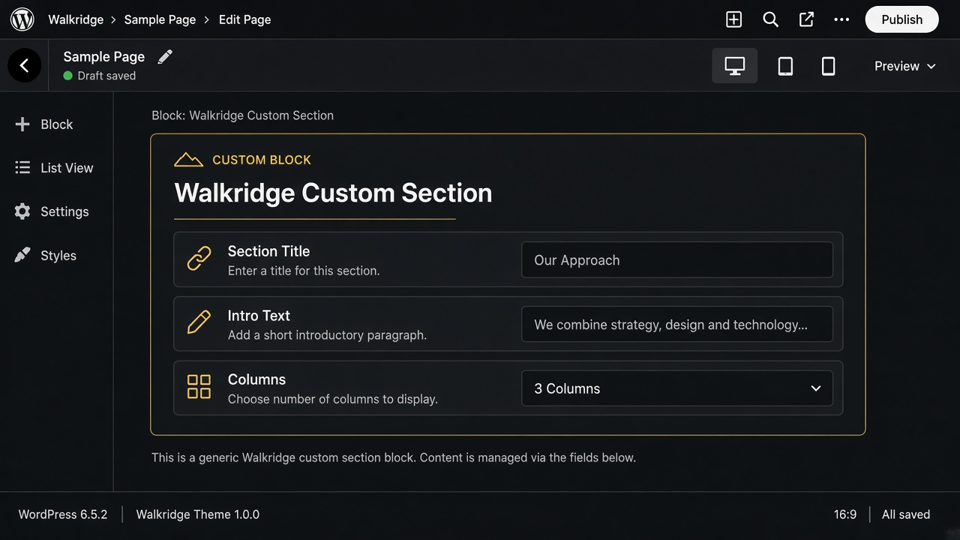

# Custom (Generator)

`walkridge/custom` · packaged at `blocks/custom/`

## When to use

Advanced

## How to insert

1. Inserter → **Walkridge** → **Custom (Generator)**.
2. Select the block. The canvas shows a live PHP preview.
3. Pick a definition created under Tools → Walkridge Blocks, then fill its fields.

## Images and media

Optional image fields if the definition includes them.

## Do not

- Do not paste this layout into a classic HTML widget — it will skip block settings.
- Do not store this copy in page custom fields.

## Related

- Theme package: `blocks/custom/block.json`
- Collection guide: [README](README.md)
