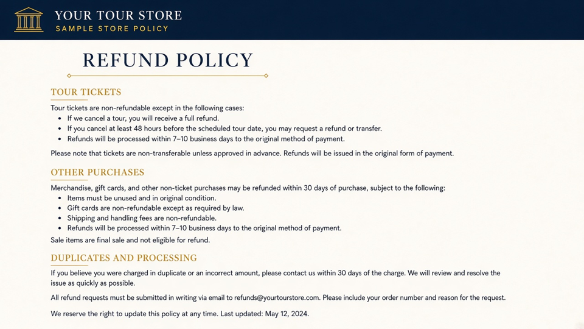

# Refund Policy

`walkridge/refund-policy` · packaged at `blocks/refund-policy/`

## When to use

Refund Policy

## How to insert

1. Inserter → **Walkridge** → **Refund Policy**.
2. Select the block. The canvas shows a live PHP preview.
3. Edit store name, URL, email, and day windows in the sidebar. One per page.

## Images and media

None.

## Do not

- Do not paste this layout into a classic HTML widget — it will skip block settings.
- Do not store this copy in page custom fields.

## Related

- Theme package: `blocks/refund-policy/block.json`
- Collection guide: [README](README.md)
